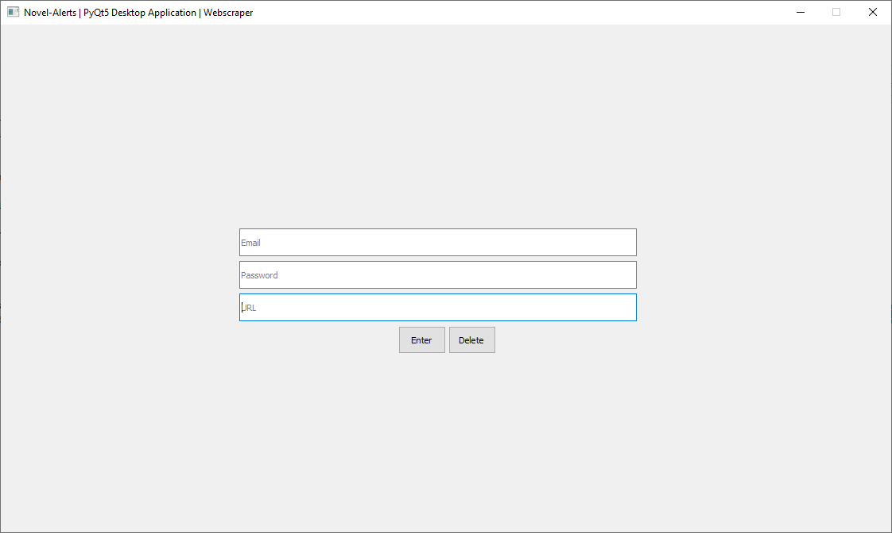

# novel-alerts
Novel alerts is a desktop GUI and an automated webscraper. The user can enter in their email, password, and any novel URL's from novelupdates.com that they want to web scrape for new updates. When those new updates are detected then a list of updated URL's will be emailed to the user.

# Screenshot

# Installation
* Go to the Github link: https://github.com/kcfang2215/novel-alerts
* Check out [Releases](https://github.com/kcfang2215/novel-alerts/releases).
* Unzip and double click the executable file to run the application.

# Features
* Receive email alerts when new updates are detected from URL data.
* Email and URL data is stored within data/
* URL data can be deleted

# How to use?
* User must enter in email and password to enable web scraping
* User should paste the novel URL link and press enter or delete to do either operation
* Leave the application on and every 10 minutes it will automatically send emails of the URL's with new updates.

# License
GPL-v3.0 
